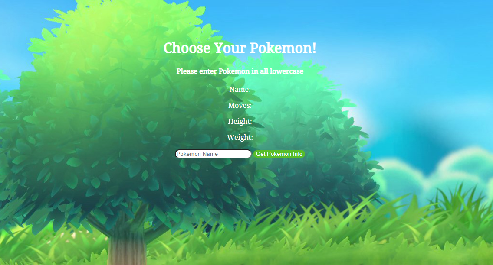

<h1>Pokemon Encyclopedia</h1>
<h4>A web application that can supply you with ever bit of informaton youll eveer need on Pokemon</h4>

<h2>Languages and Stragtegies used</h2>
<ul>
<li>HTML</li>
<li>CSS</li>
<li>JavaScript</li>
<li>jQuery</li>
<li>API Technology</li>
<li>Google Fonts</li>
</ul>

<h2>Take a look!</h2>

<h2>Getting Started</h2>

[Click Here](https://competent-euler-b82df7.netlify.app/)  to see the application in action! 

<h2>Future Enhancements</h2>

<ul>
<li> Ability to drag and drop the pokemon to a trash can to clear the canvas</li>
</ul>

